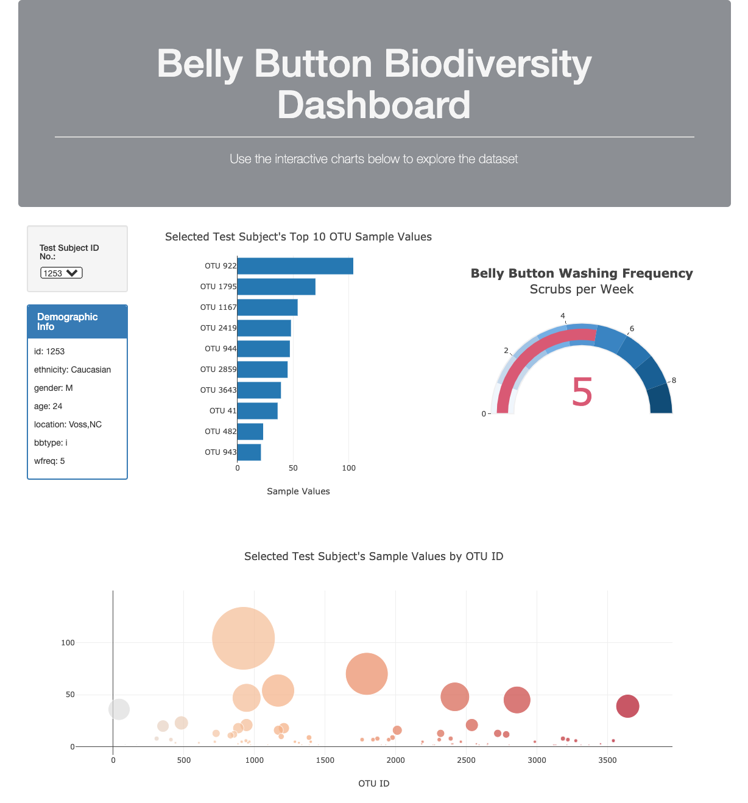

# BBB-Plotly-Dashboard

Penn Data Boot Camp Assignment 14 - An interactive dashboard made with Plotly.js to explore a "Belly Button Biodiversity" [dataset](http://robdunnlab.com/projects/belly-button-biodiversity/results-and-data/), which catalogs the microbes that colonize human navels.
The goal is to utilize Plotly, JavaScript, HTML, and CSS to display the dataset in an interesting and aesthetically pleasing way while also refresh itself based on user selection.

 

<strong>Below is a highlight of the webpage.</strong> View the fully deployed Github Pages here: https://ztcnrh.github.io/BBB-Plotly-Dashboard/

